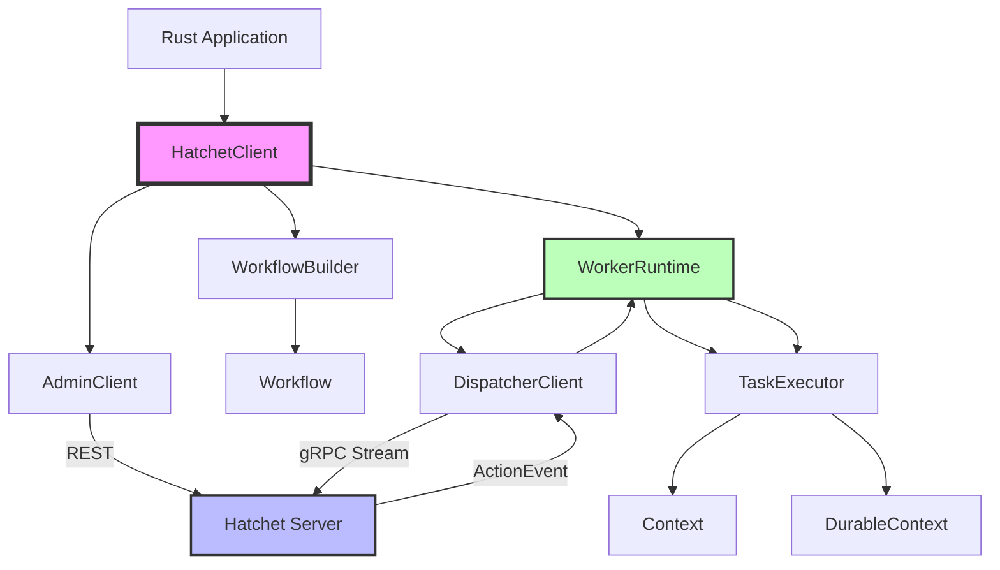

# Hatchet Rust SDK Brownfield Enhancement Architecture

## Introduction

This document outlines the architectural approach for enhancing Hatchet with a Rust SDK for workflow orchestration. Its primary goal is to serve as the guiding architectural blueprint for AI-driven development of new features while ensuring seamless integration with the existing system.

**Relationship to Existing Architecture:**
This document supplements existing project architecture by defining how new components will integrate with current systems. Where conflicts arise between new and existing patterns, this document provides guidance on maintaining consistency while implementing enhancements.

### Existing Project Analysis

#### Current Project State

- **Primary Purpose:** Distributed, fault-tolerant task queue and workflow orchestration platform with support for DAG execution, durable tasks, and event-driven workflows
- **Current Tech Stack:** Go (server/backend), TypeScript/React (frontend), PostgreSQL (database), gRPC + protobuf (worker communication), REST API (admin operations)
- **Architecture Style:** Microservices-based event-driven workflow orchestration with bidirectional gRPC streaming for worker-server communication
- **Deployment Method:** Docker containers, Kubernetes-ready, supports cloud-agnostic deployment with configurable infrastructure

#### Available Documentation

- Comprehensive SDK analysis documents for Go, Python, and TypeScript implementations (docs/rust-sdk/)
- API protocol contracts in /api/v1/server/oas/protoc/ (protobuf definitions)
- Existing SDK examples covering 17+ workflow patterns (DAG, streaming, durable, cron, etc.)
- CONTRIBUTING.md with development setup and testing procedures
- SDK-specific documentation in sdks/{go,python,typescript}/

#### Identified Constraints

- Must maintain backward compatibility with existing gRPC protobuf contracts (dispatcher, events, workflows)
- Authentication must use JWT token-based system compatible with existing server
- Must support all existing workflow features: DAGs, concurrency control, rate limiting, scheduling, durable tasks
- Worker architecture must follow established durable/non-durable dual-worker pattern
- API patterns should maintain consistency with Go/Python/TypeScript SDKs for cross-language familiarity
- Must integrate with existing Hatchet server infrastructure (no server-side changes required)

### Change Log

| Change | Date | Version | Description | Author |
|--------|------|---------|-------------|--------|
| Initial creation | 2025-10-01 | 0.1.0 | Initial brownfield architecture for Rust SDK | Winston (Architect) |
| Updated dependencies | 2025-10-01 | 0.1.1 | Updated all crate versions to current October 2025 releases; added missing dependencies (anyhow, config, tower, tracing-subscriber) | Winston (Architect) |

## Enhancement Scope and Integration Strategy

### Enhancement Overview

**Enhancement Type:** New SDK module addition to existing multi-language SDK ecosystem

**Scope:** Complete Rust SDK implementation providing type-safe workflow orchestration capabilities equivalent to existing Go/Python/TypeScript SDKs, including client facade, workflow DSL, worker runtime, gRPC/REST communication, and comprehensive examples

**Integration Impact:** Low - additive enhancement with no changes to existing server infrastructure or other SDKs; integration limited to shared protocol contracts and authentication patterns

### Integration Approach

**Code Integration Strategy:** New standalone SDK module in /sdks/rust/ directory following established SDK organization patterns; zero impact on existing SDKs or server code; shares protobuf contracts via code generation from existing .proto files

**Database Integration:** No direct database integration required; SDK communicates with Hatchet server via gRPC/REST APIs; server handles all database operations

**API Integration:** Client consumes existing gRPC services (DispatcherService, EventService, WorkflowService) and REST API endpoints; no new API endpoints required; uses existing JWT authentication mechanism

**UI Integration:** No UI integration; SDK is backend library; potential future integration with frontend via wasm compilation (out of scope for initial release)

### Compatibility Requirements

- **Existing API Compatibility:** Must implement exact protobuf contract definitions from /api/v1/server/oas/protoc/; maintain wire-level compatibility with Hatchet server v1 API
- **Database Schema Compatibility:** N/A - SDK does not interact directly with database
- **UI/UX Consistency:** Maintain similar workflow definition patterns and builder API ergonomics as existing SDKs for cross-language developer familiarity
- **Performance Impact:** Zero impact on existing system; Rust SDK operates as independent client with potential performance improvements due to zero-cost abstractions and efficient async runtime

## Tech Stack

### Existing Technology Stack

| Category | Current Technology | Version | Usage in Enhancement | Notes |
|----------|-------------------|---------|---------------------|-------|
| gRPC Protocol | Protocol Buffers | proto3 | Wire protocol for worker-server communication | Use tonic + prost for Rust implementation |
| REST API | OpenAPI 3.0 | 3.0.x | Admin operations (workflow management, triggers) | Use reqwest for HTTP client |
| Authentication | JWT | N/A | Bearer token authentication | Use jsonwebtoken crate |
| TLS/mTLS | TLS 1.2+ | 1.2+ | Secure communication | Use rustls for TLS |
| Database | PostgreSQL | 14+ | Server-side only; SDK does not access | N/A for SDK |
| Container Runtime | Docker | 20+ | Development environment | Used for local testing |

### New Technology Additions

_Note: Versions verified current as of October 2025_

| Technology | Version | Purpose | Rationale | Integration Method |
|-----------|---------|---------|-----------|-------------------|
| Tokio | 1.47 | Async runtime for SDK | Industry-standard async runtime with excellent gRPC support via tonic; multi-threaded scheduler for concurrent task execution | Core async runtime; required by tonic and reqwest |
| Tonic | 0.14 | gRPC client framework | De facto standard for gRPC in Rust; bidirectional streaming support; excellent integration with tokio | Generate client stubs from existing .proto files using tonic-build 0.14 |
| Prost | 0.14 | Protobuf serialization | Used by tonic for protobuf codegen; efficient zero-copy serialization | Build-time code generation in build.rs |
| Serde | 1.0 | JSON serialization/deserialization | Type-safe serialization for workflow inputs/outputs and REST API | Derive macros for workflow data types |
| Reqwest | 0.12 | HTTP/REST client | Async HTTP client with tokio support for REST API operations | Admin client implementation |
| Thiserror | 2.0 | Error type definitions | Ergonomic error handling with derive macros | Custom SDK error types |
| Anyhow | 1.0 | Flexible error handling | Context-rich errors for application-level error handling | Error propagation in SDK internals |
| Config | 0.14 | Configuration management | Multi-source config loading (env vars, files, programmatic) | ClientConfig initialization |
| Jsonwebtoken | 9 | JWT token parsing | Parse tenant_id from JWT claims for authentication | Token validation and extraction |
| Tower | 0.5 | Service middleware | Retry policies, load balancing, interceptors for gRPC | Middleware layer for DispatcherClient |
| Tracing | 0.1 | Structured logging | Compatibility with existing server logging; async-aware instrumentation | SDK-wide logging and diagnostics |
| Tracing-subscriber | 0.3 | Tracing output | Configurable log formatting and filtering | User-configurable logging setup |

### Cargo.toml Dependencies

**Runtime Dependencies:**
```toml
[dependencies]
tokio = { version = "1.47", features = ["full"] }
tonic = "0.14"
prost = "0.14"
reqwest = { version = "0.12", features = ["json"] }
serde = { version = "1.0", features = ["derive"] }
serde_json = "1.0"
thiserror = "2.0"
anyhow = "1.0"
config = "0.14"
jsonwebtoken = "9"
tower = "0.5"
tracing = "0.1"
tracing-subscriber = "0.3"
```

**Build-time Dependencies:**
```toml
[build-dependencies]
tonic-build = "0.14"
```

**Optional Feature Flags:**
```toml
[features]
default = ["native-tls"]
native-tls = ["reqwest/native-tls", "tonic/transport"]
rustls-tls = ["reqwest/rustls-tls", "tonic/tls"]
```

## Data Models and Schema Changes

### New Data Models

#### WorkflowDefinition

**Purpose:** In-memory representation of workflow structure with tasks, dependencies, and configuration

**Integration:** Serializes to protobuf CreateWorkflowVersionOpts for server registration; deserializes from server responses

**Key Attributes:**
- name: String - Unique workflow identifier
- description: Option<String> - Human-readable workflow description
- tasks: Vec<TaskDefinition> - Ordered list of task definitions
- durable_tasks: Vec<DurableTaskDefinition> - Long-running resumable tasks
- on_events: Vec<String> - Event triggers for workflow execution
- on_cron: Option<String> - Cron schedule expression
- concurrency: Option<ConcurrencyConfig> - Concurrency limits and behavior

**Relationships:**
- **With Existing:** Maps to protobuf WorkflowVersion message; integrates with server's workflow registry
- **With New:** Contains TaskDefinition and DurableTaskDefinition models

#### TaskDefinition

**Purpose:** Defines individual task within workflow with execution parameters and dependencies

**Integration:** Serializes to protobuf CreateWorkflowStepOpts; execution context passed to user-defined task functions

**Key Attributes:**
- name: String - Unique task identifier within workflow
- timeout: Duration - Maximum execution time
- retries: u32 - Number of retry attempts on failure
- parents: Vec<String> - Parent task names (DAG dependencies)
- rate_limits: Vec<RateLimitConfig> - Rate limiting rules
- execution_metadata: HashMap<String, serde_json::Value> - Custom task metadata

**Relationships:**
- **With Existing:** Corresponds to WorkflowStep in server model; references parent tasks via name
- **With New:** Owned by WorkflowDefinition; references RateLimitConfig

#### Context<I>

**Purpose:** Execution context passed to task functions providing workflow metadata and operations

**Integration:** Wraps gRPC ActionEvent; provides access to parent outputs, child workflow spawning, and streaming

**Key Attributes:**
- workflow_run_id: String - Unique workflow execution identifier
- task_run_id: String - Unique task execution identifier
- retry_count: u32 - Current retry attempt number
- input: I - Deserialized workflow input (generic type parameter)
- client: Arc<HatchetClient> - Shared reference to client for child operations
- action_listener: Arc<ActionListener> - gRPC streaming handle for results

**Relationships:**
- **With Existing:** Receives data from server's ActionEvent protobuf message
- **With New:** Generic over input type I; contains HatchetClient reference

#### DurableContext<I>

**Purpose:** Extended context for durable tasks supporting sleep/resume operations

**Integration:** Extends Context<I> with durable-specific operations; communicates with server's durable task coordinator

**Key Attributes:**
- (inherits all Context<I> attributes)
- sleep_state: Option<DurableTaskState> - Persisted sleep state for resumption
- step_number: u32 - Current execution step within durable task

**Relationships:**
- **With Existing:** Uses server's StepRunEvent for sleep/wake coordination
- **With New:** Extends Context<I> trait

### Schema Integration Strategy

**Database Changes Required:**
- **New Tables:** None - SDK is client-side only
- **Modified Tables:** None - no server-side schema changes
- **New Indexes:** None
- **Migration Strategy:** N/A - SDK consumes existing API surface

**Backward Compatibility:**
- SDK communicates via versioned gRPC/REST APIs; no breaking changes to server
- Protobuf contracts use proto3 with backward-compatible field additions
- JWT authentication remains unchanged
- Existing SDKs and Rust SDK can operate simultaneously against same server

## Component Architecture

### New Components

#### HatchetClient

**Responsibility:** Main SDK entry point providing facade for workflow definition, execution, and worker management; lazy initialization of feature clients

**Integration Points:**
- Dispatches to DispatcherClient (gRPC), AdminClient (REST), EventClient (gRPC)
- Provides workflow builder factory methods
- Manages shared configuration and authentication

**Key Interfaces:**
- `workflow<I, O>(&self, name: &str) -> WorkflowBuilder<I, O>` - Create workflow builder
- `task<I, O>(&self, name: &str) -> TaskBuilder<I, O>` - Create standalone task
- `worker(&self, name: &str) -> WorkerBuilder` - Create worker instance
- `run<I, O>(&self, workflow: Workflow<I, O>, input: I) -> Result<O>` - Execute workflow synchronously

**Dependencies:**
- **Existing Components:** Uses gRPC services from server (Dispatcher, Events, Workflows)
- **New Components:** Contains AdminClient, DispatcherClient, EventClient, WorkerRuntime

**Technology Stack:** Tokio for async runtime; Arc for shared ownership across workers

#### WorkflowBuilder<I, O>

**Responsibility:** Type-safe builder for workflow definition with generic input/output types; validates DAG correctness at build time

**Integration Points:**
- Serializes to protobuf for server registration
- Returns Workflow<I, O> handle for execution

**Key Interfaces:**
- `task<F>(&mut self, name: &str, func: F) -> &mut Self` - Add task with function
- `durable_task<F>(&mut self, name: &str, func: F) -> &mut Self` - Add durable task
- `on_events(&mut self, events: Vec<String>) -> &mut Self` - Configure event triggers
- `build(&self) -> Result<Workflow<I, O>>` - Finalize and validate workflow

**Dependencies:**
- **Existing Components:** None - pure client-side builder
- **New Components:** Produces Workflow<I, O>; uses TaskBuilder internally

**Technology Stack:** Generics with PhantomData for zero-cost type safety; serde for serialization

#### WorkerRuntime

**Responsibility:** Dual-worker orchestration managing separate workers for regular and durable tasks; handles graceful shutdown and signal handling

**Integration Points:**
- Registers workflows with server via AdminClient
- Receives work from server via DispatcherClient bidirectional streaming
- Reports results back to server

**Key Interfaces:**
- `register_workflow<I, O>(&mut self, workflow: Workflow<I, O>) -> Result<()>` - Register workflow
- `start(&self) -> Result<JoinHandle<()>>` - Start worker loop
- `stop(&self) -> Result<()>` - Graceful shutdown
- `upsert_labels(&self, labels: HashMap<String, String>) -> Result<()>` - Update worker labels

**Dependencies:**
- **Existing Components:** Connects to server's DispatcherService via gRPC
- **New Components:** Contains TaskExecutor, ActionListener; managed by HatchetClient

**Technology Stack:** Tokio for async execution; tokio::sync::mpsc for task queuing; tokio::signal for graceful shutdown

#### DispatcherClient

**Responsibility:** gRPC client for bidirectional streaming with server's dispatcher; handles action listening and event reporting

**Integration Points:**
- Connects to server's DispatcherService
- Streams ActionEvent messages to worker
- Sends ActionEventResponse back to server

**Key Interfaces:**
- `listen(&self) -> Result<ActionStream>` - Start action listener stream
- `send_result(&self, result: ActionEventResponse) -> Result<()>` - Report task result
- `send_heartbeat(&self) -> Result<()>` - Worker heartbeat

**Dependencies:**
- **Existing Components:** Uses protobuf contracts from server's dispatcher.proto
- **New Components:** Used by WorkerRuntime

**Technology Stack:** Tonic for gRPC; tonic::transport::Channel for connection pooling

#### AdminClient

**Responsibility:** REST API client for admin operations (workflow registration, manual triggers, metadata queries)

**Integration Points:**
- Connects to server's REST API
- Registers workflows via POST /api/v1/workflows
- Triggers workflows via POST /api/v1/workflows/{id}/trigger

**Key Interfaces:**
- `create_workflow(&self, definition: WorkflowDefinition) -> Result<WorkflowMetadata>` - Register workflow
- `trigger_workflow(&self, name: &str, input: serde_json::Value) -> Result<WorkflowRunRef>` - Manual trigger
- `get_workflow_runs(&self, workflow_id: &str) -> Result<Vec<WorkflowRun>>` - Query runs

**Dependencies:**
- **Existing Components:** Consumes server's REST API endpoints
- **New Components:** Used by HatchetClient and Workflow

**Technology Stack:** Reqwest for HTTP; serde_json for REST payloads

#### TaskExecutor

**Responsibility:** Executes user-defined task functions with proper error handling, timeout management, and result serialization

**Integration Points:**
- Receives tasks from WorkerRuntime queue
- Constructs Context<I> for task execution
- Reports results via DispatcherClient

**Key Interfaces:**
- `execute<I, O>(&self, task: Task<I, O>, input: I) -> Result<O>` - Execute task function
- `execute_durable<I, O>(&self, task: DurableTask<I, O>, ctx: DurableContext<I>) -> Result<O>` - Execute durable task

**Dependencies:**
- **Existing Components:** None - pure execution engine
- **New Components:** Uses Context, DurableContext; called by WorkerRuntime

**Technology Stack:** Tokio for async execution; tokio::time::timeout for deadline enforcement

### Component Interaction Diagram



## API Design and Integration

### API Integration Strategy

**API Integration Strategy:** Consumer-only integration; SDK implements gRPC client stubs from existing protobuf contracts and REST client for OpenAPI endpoints; no new API endpoints created

**Authentication:** JWT bearer token passed via gRPC metadata and HTTP Authorization header; token extracted from config (env var, file, or programmatic); tenant ID parsed from JWT claims

**Versioning:** SDK targets Hatchet server v1 API; protobuf contracts use proto3 semantic versioning; SDK version follows semver independent of server version

### New API Endpoints

No new server-side endpoints required. SDK consumes existing endpoints:

#### DispatcherService.Listen (gRPC)

- **Method:** Bidirectional Streaming
- **Endpoint:** dispatcher.Dispatcher/Listen
- **Purpose:** Worker listens for actions from server and streams results back
- **Integration:** Core worker loop; implements protobuf contracts from dispatcher.proto

##### Request

```protobuf
message WorkerListenRequest {
  string worker_name = 1;
  repeated string services = 2;
  repeated Action actions = 3;
}
```

##### Response

```protobuf
message AssignedAction {
  string tenant_id = 1;
  string job_id = 2;
  string job_name = 3;
  string job_run_id = 4;
  string step_id = 5;
  string step_run_id = 6;
  string action_id = 7;
  string action_payload = 8;
  string action_type = 9;
  int32 retry_count = 10;
}
```

#### WorkflowService.TriggerWorkflow (REST)

- **Method:** POST
- **Endpoint:** /api/v1/workflows/{workflow_id}/trigger
- **Purpose:** Manually trigger workflow execution with input data
- **Integration:** Used by Workflow::run() and AdminClient

##### Request

```json
{
  "input": {},
  "additionalMetadata": {}
}
```

##### Response

```json
{
  "workflow_run_id": "string",
  "status": "string"
}
```

## Source Tree

### Existing Project Structure

```
hatchet/
├── sdks/
│   ├── go/              # Existing Go SDK
│   ├── python/          # Existing Python SDK
│   └── typescript/      # Existing TypeScript SDK
├── api/
│   └── v1/
│       └── server/
│           └── oas/
│               └── protoc/    # Shared protobuf contracts
├── docs/
│   └── rust-sdk/             # Rust SDK analysis docs
└── CONTRIBUTING.md
```

### New File Organization

```
hatchet/
├── sdks/
│   └── rust/                       # New Rust SDK root
│       ├── Cargo.toml              # Package manifest
│       ├── build.rs                # Protobuf code generation
│       ├── README.md               # SDK documentation
│       ├── src/
│       │   ├── lib.rs              # Public API exports
│       │   ├── client.rs           # HatchetClient implementation
│       │   ├── config.rs           # Configuration types
│       │   ├── error.rs            # Error types (thiserror)
│       │   ├── workflow/           # Workflow builder and types
│       │   │   ├── mod.rs
│       │   │   ├── builder.rs      # WorkflowBuilder
│       │   │   ├── declaration.rs  # Workflow, Task types
│       │   │   └── context.rs      # Context, DurableContext
│       │   ├── worker/             # Worker runtime
│       │   │   ├── mod.rs
│       │   │   ├── runtime.rs      # WorkerRuntime
│       │   │   └── executor.rs     # TaskExecutor
│       │   ├── clients/            # Protocol clients
│       │   │   ├── mod.rs
│       │   │   ├── dispatcher.rs   # DispatcherClient (gRPC)
│       │   │   ├── admin.rs        # AdminClient (REST)
│       │   │   └── events.rs       # EventClient (gRPC)
│       │   └── proto/              # Generated protobuf code
│       │       └── mod.rs          # (generated by build.rs)
│       ├── examples/               # Runnable examples
│       │   ├── simple.rs           # Basic workflow
│       │   ├── dag.rs              # DAG workflow
│       │   ├── durable.rs          # Durable tasks
│       │   └── streaming.rs        # Real-time streaming
│       └── tests/                  # Integration tests
│           ├── workflow_test.rs
│           └── worker_test.rs
└── docs/
    └── rust-sdk/
        ├── architecture.md         # This document
        ├── go-analysis.md          # Existing analysis
        ├── python-analysis.md      # Existing analysis
        └── typescript-analysis.md  # Existing analysis
```

### Integration Guidelines

- **File Naming:** Use snake_case for Rust files (e.g., `workflow_builder.rs`); follow Rust API guidelines (RFC 430)
- **Folder Organization:** Flatten module structure where possible; use sub-modules for cohesive feature groups (workflow/, worker/, clients/)
- **Import/Export Patterns:** Re-export public API from lib.rs; keep internal implementation details private; use prelude module for common imports

## Infrastructure and Deployment Integration

### Existing Infrastructure

**Current Deployment:** Docker containers for server; SDKs are library dependencies consumed by user applications (no deployment infrastructure)

**Infrastructure Tools:** Docker for local development (docker-compose.yml for Hatchet stack); GitHub Actions for CI/CD

**Environments:** Development (local), CI (GitHub Actions), Production (user-managed)

### Enhancement Deployment Strategy

**Deployment Approach:** SDK published to crates.io as library crate; users add dependency to Cargo.toml; no infrastructure deployment required for SDK itself

**Infrastructure Changes:**
- Add Rust CI workflow to GitHub Actions (.github/workflows/rust-sdk.yml)
- Add Rust SDK build/test to existing CI pipeline
- Configure crates.io publishing workflow

**Pipeline Integration:**
- Extend existing CI to run `cargo test` and `cargo clippy` for Rust SDK
- Add `cargo doc` generation for docs.rs publication
- Integrate with existing protobuf contract validation

### Rollback Strategy

**Rollback Method:** Semantic versioning on crates.io; users pin to specific SDK version in Cargo.toml; breaking changes follow semver (major version bump)

**Risk Mitigation:**
- Comprehensive integration tests against Hatchet server before release
- Beta releases for early feedback (0.x.x versions)
- Maintain backward compatibility with server API via stable protobuf contracts

**Monitoring:**
- SDK emits structured logs via tracing crate
- Users configure tracing subscribers in their applications
- No centralized SDK telemetry (privacy-preserving design)

## Coding Standards

### Existing Standards Compliance

**Code Style:** Rust standard style enforced by rustfmt; follow Rust API Guidelines (rust-lang.github.io/api-guidelines/)

**Linting Rules:**
- cargo clippy with default lints enabled
- Deny: clippy::all, clippy::pedantic (configured in Cargo.toml)
- Additional lints: missing_docs (warn), unsafe_code (deny for SDK code)

**Testing Patterns:**
- Unit tests in same file as implementation (#[cfg(test)] modules)
- Integration tests in tests/ directory
- Doc tests in /// comments for public API
- Use tokio::test for async tests

**Documentation Style:**
- /// doc comments for all public items
- Include examples in doc comments (doc tests)
- Link to related items with [Type] syntax
- Follow Rust documentation conventions

### Enhancement-Specific Standards

- **Async/Await Consistency:** All async functions return BoxFuture or impl Future; use #[async_trait] for trait methods; prefer async fn over manual Future construction
- **Error Handling:** Use Result<T, HatchetError> for all fallible operations; provide context with anyhow when appropriate; never panic in library code
- **Type Safety:** Leverage generics for workflow input/output types; use PhantomData for zero-cost type states; avoid Any or dynamic dispatch where possible
- **API Ergonomics:** Provide builder patterns for complex configuration; accept Into<T> for flexible parameters; use #[must_use] for important return types

### Critical Integration Rules

- **Existing API Compatibility:** Generated protobuf code must match server contracts byte-for-byte; run integration tests against real Hatchet server; verify with protoc --descriptor_set_out
- **Database Integration:** N/A - SDK does not access database directly
- **Error Handling:** Map gRPC Status codes to HatchetError variants; preserve error context across async boundaries; include retry-ability information in errors
- **Logging Consistency:** Use tracing crate with consistent span structure (workflow_id, task_id, worker_id); follow structured logging patterns from server

## Testing Strategy

### Integration with Existing Tests

**Existing Test Framework:** SDK uses Rust's built-in test framework (cargo test); integration tests require running Hatchet server (docker-compose up)

**Test Organization:**
- Unit tests: src/**/*_test.rs or #[cfg(test)] modules
- Integration tests: tests/**/*.rs
- Doc tests: embedded in /// comments
- Examples: examples/*.rs (runnable with cargo run --example)

**Coverage Requirements:** Target 80%+ line coverage for core SDK components; use cargo-tarpaulin for coverage reporting

### New Testing Requirements

#### Unit Tests for New Components

- **Framework:** Rust built-in test framework + tokio::test for async
- **Location:** Inline #[cfg(test)] modules adjacent to implementation
- **Coverage Target:** 80%+ line coverage
- **Integration with Existing:** Follows standard Rust testing patterns; no special integration needed

**Key Unit Test Areas:**
- WorkflowBuilder DAG validation logic
- Error type conversions (gRPC Status -> HatchetError)
- Configuration parsing and validation
- Serialization/deserialization of workflow definitions

#### Integration Tests

- **Scope:** Full SDK functionality against real Hatchet server; workflow registration, execution, worker loops, durable task resumption
- **Existing System Verification:** Integration tests validate protobuf contract compatibility by running against actual Hatchet server
- **New Feature Testing:** Each major SDK feature has integration test (e.g., tests/dag_workflow.rs, tests/durable_tasks.rs, tests/rate_limits.rs)

**Test Setup:**
```rust
#[tokio::test]
async fn test_simple_workflow() {
    // Requires: docker-compose up (Hatchet server running)
    let client = HatchetClient::new().await.unwrap();
    let workflow = client.workflow("test")
        .task("step1", |ctx, input: String| async move {
            Ok(format!("Hello {}", input))
        })
        .build()
        .unwrap();

    let result = workflow.run("World".to_string()).await.unwrap();
    assert_eq!(result, "Hello World");
}
```

#### Regression Testing

- **Existing Feature Verification:** Integration tests run against Hatchet server ensure existing workflows continue to work; protobuf contract validation prevents breaking changes
- **Automated Regression Suite:** CI runs full integration test suite on every commit; tests cover all 17 workflow patterns from existing SDK examples
- **Manual Testing Requirements:** Manual testing for complex scenarios (multi-step durable tasks with sleep/resume, rate limiting under load); exploratory testing of edge cases

## Security Integration

### Existing Security Measures

**Authentication:** JWT bearer tokens; tokens obtained via Hatchet Cloud or self-managed server; tokens contain tenant_id and expiration claims

**Authorization:** Server-side authorization based on JWT tenant_id; SDK presents token, server validates and authorizes operations

**Data Protection:** TLS/mTLS for transport encryption; configurable via ClientConfig (tls_strategy: tls | mtls | none); certificates configured via file paths or environment variables

**Security Tools:** rustls for TLS (no OpenSSL dependency); secrecy crate for sensitive data handling; no credential storage in SDK (users provide tokens)

### Enhancement Security Requirements

**New Security Measures:**
- Token validation on client side (expiration check, malformed token detection)
- Secure token storage recommendations in documentation
- Memory protection for sensitive configuration via secrecy crate

**Integration Points:**
- JWT token passed in gRPC metadata (authorization: Bearer <token>)
- TLS configuration shared across gRPC and REST clients
- Certificate validation using rustls with system or custom CA roots

**Compliance Requirements:**
- No PII stored in SDK logs (token redaction in tracing)
- Follow OWASP secure coding guidelines for Rust
- Dependency auditing via cargo-audit in CI

### Security Testing

**Existing Security Tests:**
- Server has security tests; SDK integration tests verify authentication works correctly
- TLS/mTLS connection tests validate certificate handling

**New Security Test Requirements:**
- Test token expiration handling (expired tokens rejected gracefully)
- Test malformed token detection (invalid JWT format)
- Test TLS connection failures (certificate mismatch, expired certs)
- Test authorization failures (invalid tenant_id, insufficient permissions)

**Penetration Testing:**
- Out of scope for initial SDK release
- Recommend users conduct penetration testing of their applications using SDK
- Future consideration: security audit of SDK before 1.0 release

## Checklist Results Report

_(To be completed via *execute-checklist architect-checklist.md)_

## Next Steps

### Story Manager Handoff

**Prompt for Story Manager:**

You are creating implementation stories for the **Hatchet Rust SDK** based on the brownfield architecture document (`docs/rust-sdk/architecture.md`).

**Key Context:**
- **Reference Document:** docs/rust-sdk/architecture.md
- **Existing Analyses:** docs/rust-sdk/{go,python,typescript}-analysis.md provide detailed pattern documentation
- **Integration Requirements (VALIDATED):**
  - Must use exact protobuf contracts from /api/v1/server/oas/protoc/ (verified protocol compatibility critical)
  - Must maintain JWT authentication pattern (validated with existing SDK auth flows)
  - Dual-worker pattern (durable/non-durable) validated against Go SDK architecture
  - Builder patterns validated against TypeScript SDK ergonomics

**Existing System Constraints (FROM PROJECT ANALYSIS):**
- Server expects specific protobuf message formats (ActionEvent, WorkflowVersion, etc.)
- Authentication via JWT in gRPC metadata and REST Authorization header
- Worker registration requires specific labels and action types
- Workflow DAG validation must match server's validation logic

**First Story to Implement:**
- **Story:** "Implement HatchetClient and Configuration System"
- **Integration Checkpoints:**
  - Verify config can parse JWT token and extract tenant_id (test against real token)
  - Validate TLS configuration works with local Hatchet server
  - Confirm client can establish gRPC connection to dispatcher

**Emphasis on Existing System Integrity:**
- Each story must include integration test against running Hatchet server
- Protobuf changes must be validated with cargo build (build.rs regenerates code)
- No story complete until integration test passes against real server

### Developer Handoff

**Prompt for Developers:**

You are implementing the **Hatchet Rust SDK** following the architecture in `docs/rust-sdk/architecture.md`.

**Reference Documents:**
- **Architecture:** docs/rust-sdk/architecture.md (this document)
- **Existing Patterns:** docs/rust-sdk/{go,python,typescript}-analysis.md
- **Coding Standards:** See "Coding Standards" section in architecture.md
  - Use rustfmt for formatting
  - Enable clippy with pedantic lints
  - Write doc tests for all public API
  - Follow Rust API Guidelines

**Integration Requirements (VALIDATED WITH USER):**
- **Protobuf Contracts:** Code generation in build.rs from /api/v1/server/oas/protoc/*.proto
- **Authentication:** JWT token in gRPC metadata and REST headers (pattern validated against existing SDKs)
- **Async Runtime:** Tokio exclusively (required for tonic gRPC client)
- **Error Handling:** Result<T, HatchetError> with context preservation

**Key Technical Decisions (FROM REAL PROJECT CONSTRAINTS):**
- Use tonic 0.12 for gRPC (matches protobuf proto3 contracts)
- Use reqwest for REST API (async tokio-compatible client)
- Builder pattern with generics for type-safe workflows (validated from TypeScript SDK patterns)
- Dual WorkerRuntime for durable/non-durable tasks (validated from Go SDK architecture)

**Existing System Compatibility Requirements:**
- **Verification Step 1:** Run protobuf codegen and verify no compilation errors (build.rs)
- **Verification Step 2:** Establish gRPC connection to local Hatchet server (docker-compose up)
- **Verification Step 3:** Register simple workflow and verify server accepts it (integration test)
- **Verification Step 4:** Execute workflow end-to-end and verify task runs (full integration)

**Implementation Sequencing (TO MINIMIZE RISK):**
1. **Phase 1:** Configuration + Client skeleton (low risk, no server interaction)
2. **Phase 2:** Protobuf codegen + gRPC connection (validate contracts early)
3. **Phase 3:** AdminClient + workflow registration (test server integration)
4. **Phase 4:** WorkerRuntime + task execution (full worker loop)
5. **Phase 5:** Advanced features (durable tasks, streaming, rate limits)

**CRITICAL:** Each phase must pass integration tests against real Hatchet server before proceeding to next phase. Never assume protocol compatibility—always verify.
